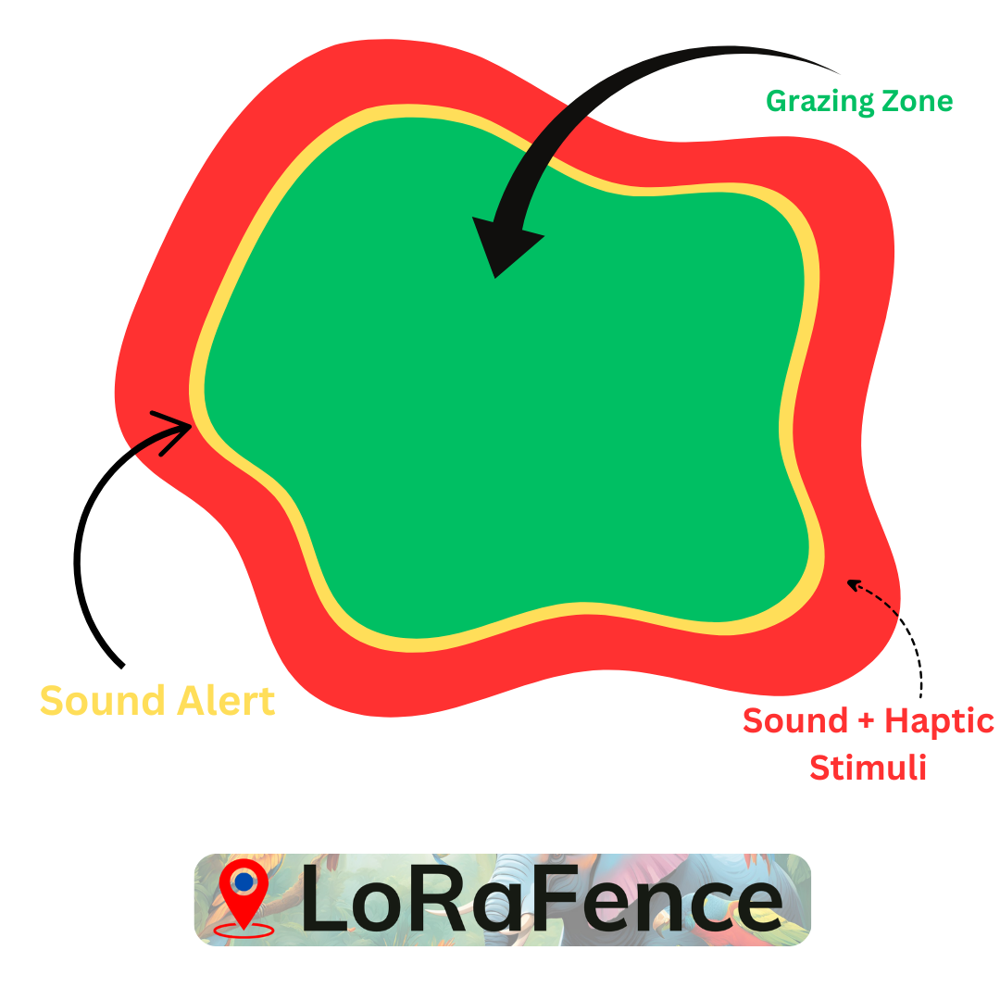
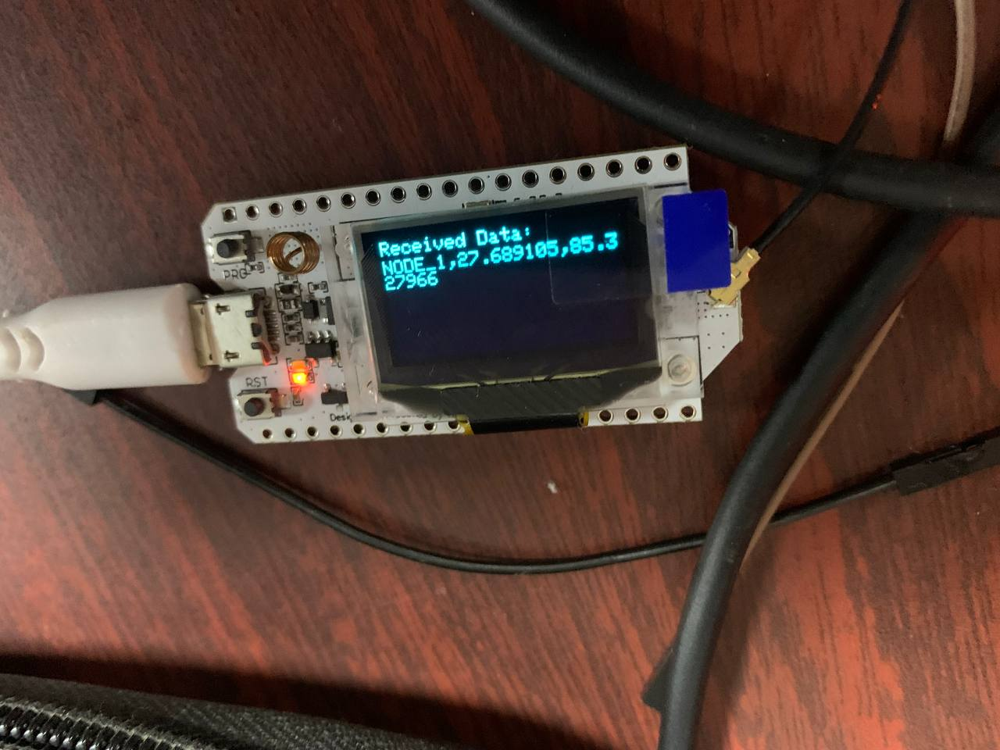
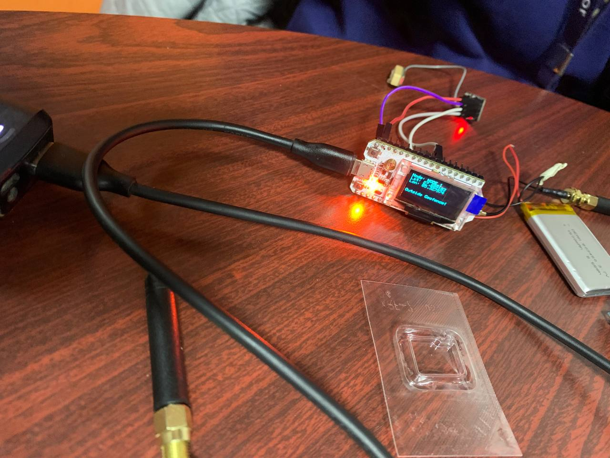
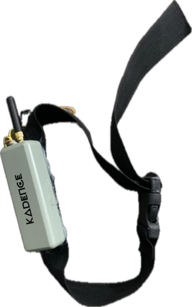
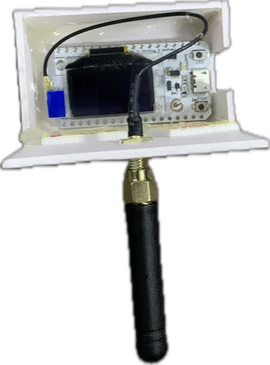

# LoRaFence - Advanced Wildlife Tracking System

Welcome to **LoRaFence**, Developed by the **United Technical College**, LoRaFence harnesses advanced LoRa technology for precise and efficient animal tracking and virtual fencing. With cutting-edge enhancements like embedded displays, collars for animals, and multi-tracker systems, LoRaFence is poised to redefine animal tracking in conservation and research. This project is a proud participant in the Semi;Colon Hackathon, and with your support, we're aiming for the win!

---

---

## Overview

**LoRaFence** is designed to revolutionize animal tracking and virtual fencing using LoRa technology. Operating on the unlicensed ISM bands of **433MHz** and **868MHz** (approved by the Nepal government for M2M and IoT communications), LoRaFence ensures reliable, long-range communication even in the most remote areas.

---

## Key Features

- **Frequency**: Operates on the 433MHz and 868MHz ISM bands
- **Enhanced Tracking**: Includes animal collars for precise GPS location tracking
- **Raspberry Pi Integration**: Onboard display module for ranger vehicles for real-time monitoring
- **Multi-Tracker Display**: Supports simultaneous tracking of multiple devices
- **Low Power Consumption**: Extended battery life suitable for prolonged deployments
- **Long-Range Communication**: Connectivity up to **50 KM** in optimal conditions
- **Cloud Integration**: Seamless real-time data synchronization
- **Robust Design**: Weather-resistant and durable for field conditions
- **Virtual Fencing with Stimuli Feedback**: Two-threshold geofencing system with sound and haptic feedback to control animals or cattle within specific areas
- **Mesh Network Implementation**: Optimized for scalable and long-range deployments

---

## Objectives

1. **Animal Tracking**: Monitor animal movement and behavior to support conservation efforts.
2. **Virtual Fencing**: Control animals or cattle within a defined geofence area using sound and haptic feedback.

---

## System Components

### 1. **LoRa Animal Collars**

- Lightweight and durable design
- Real-time GPS tracking
- Low-power operation for extended use
- Integrated haptic sensors and sound emitters for stimuli feedback

### 2. **Raspberry Pi Display Module**

- Installed in ranger vehicles for intuitive tracking
- High-resolution display for clear visibility
- Real-time updates with seamless data synchronization

### 3. **Multi-Tracker Display System**

- Monitors multiple trackers simultaneously
- Easy-to-navigate interface
- Suitable for wildlife patrol teams

---

## Advantages Over Traditional Technologies

| **Criteria**           | **LoRaFence**                  | **Satellite**              | **Cellular**                 |
| ---------------------- | ------------------------------ | -------------------------- | ---------------------------- |
| **Cost-Effectiveness** | Low operational cost           | High subscription costs    | SIM cards and data fees      |
| **Power Efficiency**   | Extremely low power            | High power consumption     | Medium power usage           |
| **Range & Coverage**   | Up to 50 KM in rural areas     | Global coverage, high cost | Limited to network areas     |
| **Scalability**        | Supports dense IoT networks    | Expensive to scale         | Limited by cost              |
| **Data Throughput**    | Ideal for IoT sensors          | Excessive for IoT          | High but inefficient for IoT |
| **Ease of Deployment** | Private networks, simple setup | Complex and costly         | Dependent on infrastructure  |
| **Privacy & Security** | Full control with private nets | Data via third parties     | Data vulnerable to leaks     |

---

## Deployment Use Cases

1. **Wildlife Conservation**: Track endangered species and study migration patterns without disturbing their habitat.
2. **Animal Control**: Use virtual fencing with sound and haptic feedback to guide animals or cattle within a specific area.

---

## How It Works

1. **Animal Collars** with embedded LoRa modules transmit GPS data and stimuli feedback.
2. **Raspberry Pi Display Modules** receive and display the location data in ranger vehicles.
3. Data is uploaded to the **cloud** for centralized monitoring and management.
4. Animals are controlled within a geofence using a two-threshold system:
   - **First Zone**: Audible sounds to recall animals.
   - **Second Zone**: Haptic feedback for stronger stimuli.

---

---

## LoRaFence Picture

<table>
  <tr>
    <td></td>
    <td></td>
    <td></td>
  </tr>
  <tr>
    <td></td>
    <td></td>
    <td></td>
  </tr>
</table>
  
  ---

